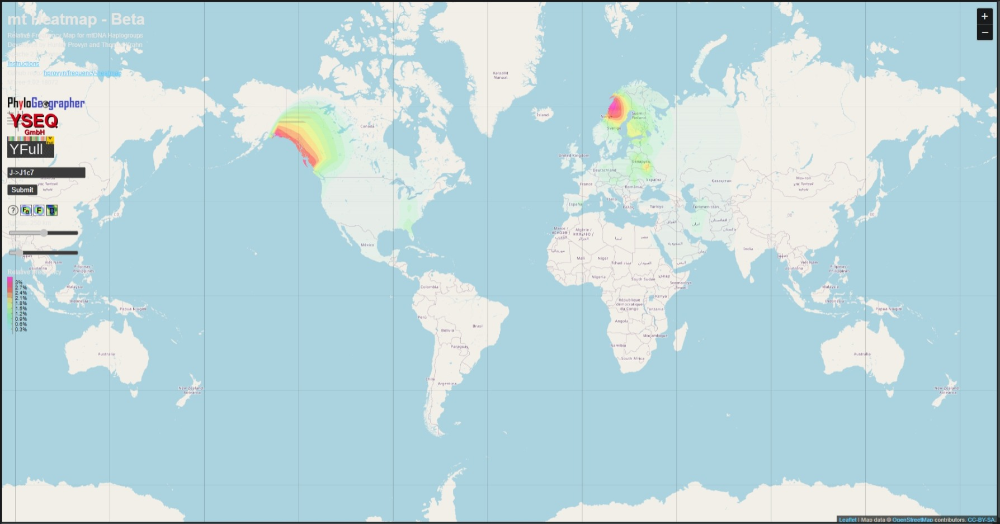

## TASK 1

1. Y-chromosomalna
2. Mitochondrialna
3. Autosomalna

## TASK 2

Nie

## TASK 3

N jest to nukleotyd o pełnej nazwie Adenina / Guanina / Cytosinea/ Tymina. Gdyby zawierał taki nukleotyd oznaczałoby, że istnieje zmienność przeciwciał V(D)J.

## TASK 4

Genom nie zawiera ozaczeń innych niż A, C, T lub G, oznacza to, że genom składa się tylko z Adeniny, Cytozyny, Guaniny i Tyniny. Świadczy to o tym, że jest to czyste DNA bez RNA.

## TASK 5

Oznaczenie Y świadczyłoby o obecności Pirymidyny $C_4H_4N_2$.

## TASK 6

Pełne regiony podanego mDNA to HVR2 oraz HVR1.

## TASK 7

Znalazł markery HVR2, CR, HVR1

## TASK 8

Marker genetyczny jest to cecha organizmu wykorzystywana do określenia jego genotypu. Może to być obecność lub brak jakiegoś genu lub białka, albo występowanie jakiejś szczególnej jego postaci. Markery genetyczne znajdują też zastosowanie do identyfikowania osób lub osobników zwierząt czy roślin.

## TASK 9

Algorytm wykazał haplogrupę J1c7.

## TASK 10

rCRS to skrót od Revised Camridge Reference Sequence.

## TASK 11

H2a2a1

## TASK 12

- Nr. EU151466.1
- Narodowość: Francja, uniwersytet Hiszpański.

## TASK 13

Występuje mutacja S: Tranzycja - zamiana guaniny na adeninę.

## TASK 14

## TASK 15

DYS456- to marker genetyczny w DNA, a dokładniej na chromosomie Y.

## TASK 16

Sekwencja, która się powtarza, to 12 nukleotydów.

## TASK 17

27

## TASK 18

Za pomocą tego narzędzia można *przewidzieć* haplogrupę i znaleźć najbardziej prawdopodobną.

## TASK 19

Jest to baza zawierająca informacje na teamt haplogrupy chromosomu Y.

## TASK 20

## TASK 21

## TASK 22

## TASK 23

## TASK 24

## TASK 25

## TASK 26

## TASK 27
