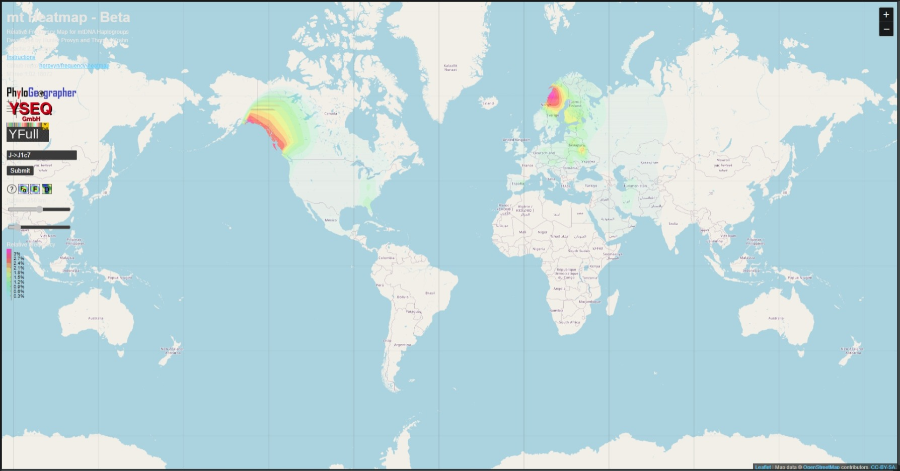

## TASK 1

1. Y-chromosomalna
2. Mitochondrialna
3. Autosomalna

## TASK 2

Nie

## TASK 3

N jest to nukleotyd o pełnej nazwie Adenina / Guanina / Cytosinea/ Tymina. Gdyby zawierał taki nukleotyd oznaczałoby, że istnieje zmienność przeciwciał V(D)J.

## TASK 4

Genom nie zawiera ozaczeń innych niż A, C, T lub G, oznacza to, że genom składa się tylko z Adeniny, Cytozyny, Guaniny i Tyniny. Świadczy to o tym, że jest to czyste DNA bez RNA.

## TASK 5

Oznaczenie Y świadczyłoby o obecności Pirymidyny  $\C_4H_4N_2$.

## TASK 6

Pełne regiony podanego mDNA to $HVR_2$ oraz $HVR_1$.

## TASK 7

Znalazł markery HVR2, CR, HVR1

## TASK 8

Marker genetyczny jest to cecha organizmu wykorzystywana do określenia jego genotypu. Może to być obecność lub brak jakiegoś genu lub białka, albo występowanie jakiejś szczególnej jego postaci. Markery genetyczne znajdują też zastosowanie do identyfikowania osób lub osobników zwierząt czy roślin.

## TASK 9

Algorytm wykazał haplogrupę J1c7.

## TASK 10

rCRS to skrót od Revised Camridge Reference Sequence.

## TASK 11

H2a2a1

## TASK 12

- Nr. EU151466.1
- Narodowość: Francja, uniwersytet Hiszpański.

## TASK 13

Występuje mutacja S: Tranzycja - zamiana guaniny na adeninę.

## TASK 14



## TASK 15

DYS456- to marker genetyczny w DNA, a dokładniej na chromosomie Y.

## TASK 16

Sekwencja, która się powtarza, to 12 nukleotydów.

## TASK 17

27

## TASK 18

Za pomocą tego narzędzia można *przewidzieć* haplogrupę i znaleźć najbardziej prawdopodobną.

## TASK 19

Jest to baza zawierająca informacje na teamt haplogrupy chromosomu Y.

## TASK 20

- Minimalny zestaw markerów dla inkluzji YHRD
- Y12 - zestaw markerów pochodnych od PowerPlex Y
- Y17 - zestaw markerów pochodnych od Yfiler
- Y23 - zesttaw markerów pochodnych od PowerPlex 23
- Y27 - zestaw makerów pochodnych od Yfiler Plus
- Ymax - maerkerów reprezentujący wszystkie dostępne markery YHRD

## TASK 21

Zaobserwowane allele dla markera DYS19 to:

- 6,
- 9,
- 10
- 11,
- 12,
- 13,
- 13.2,
- 13.3,
- 14,
- 14.1,
- 14.2,
- 14.3,
- 15,
- 15.2,
- 16,
- 16.2,
- 17,
- 18,
- 19,
- 19.1,
- 20

## TASK 22

Baza YHRD zawiera 106 025 haplotypów

## TASK 23

| Count | DYS391 | DYS389I | DYS439 | DYS389II | DYS438 | DYS437 | DYS19 | DYS392 | DYS393 | DYS390 | DYS385 |
| ----- | ------ | ------- | ------ | -------- | ------ | ------ | ----- | ------ | ------ | ------ | ------ |
| 295   | 10     | 13      | 10     | 30       | 11     | 14     | 17    | 11     | 13     | 25     | 10,14  |
| 261   | 10     | 13      | 11     | 29       | 11     | 14     | 16    | 11     | 13     | 25     | 11,14  |
| 138   | 10     | 13      | 10     | 30       | 11     | 14     | 16    | 11     | 13     | 25     | 11,14  |
| 116   | 11     | 13      | 10     | 30       | 11     | 14     | 16    | 11     | 13     | 25     | 11,14  |
| 88    | 11     | 13      | 10     | 30       | 11     | 14     | 15    | 11     | 13     | 25     | 11,14  |
| 82    | 11     | 13      | 13     | 31       | 10     | 15     | 16    | 11     | 13     | 24     | 14,15  |
| 78    | 10     | 13      | 11     | 30       | 11     | 14     | 16    | 11     | 13     | 25     | 11,14  |
| 75    | 10     | 13      | 10     | 30       | 11     | 14     | 16    | 11     | 13     | 25     | 10,14  |
| 73    | 10     | 13      | 11     | 29       | 11     | 14     | 15    | 11     | 13     | 25     | 11,14  |
| 70    | 10     | 13      | 10     | 30       | 11     | 14     | 15    | 11     | 13     | 25     | 11,14  |

[Poprawiona tabela z walidatora, za pomocą opcji Search](PBIO-Y12-TASK23_validated.xlsx)

## TASK 24

Użyto zestawu PowerPlex Y, który jest opisany w podanym linku.

## TASK 25

| Probability of Relationship (%) |                 |                  |                  |                  |                  |                  |
| ------------------------------- | --------------- | ---------------- | ---------------- | ---------------- | ---------------- | ---------------- |
| Generations to MRCA             | 30 of 30Matches | 29 of 30 Matches | 28 of 30 Matches | 27 of 30 Matches | 26 of 30 Matches | 25 of 30 Matches |
| 1                               | 22.7            | 2.7              | 0.2              |                  |                  |                  |
| 2                               | 40.3            | 9.2              | 1.4              | 0.2              |                  |                  |
| 3                               | 53.9            | 17.7             | 4                | 0.7              | 0.1              |                  |
| 4                               | 64.4            | 27               | 8                | 1.8              | 0.3              |                  |
| 5                               | 72.5            | 36.2             | 13.1             | 3.6              | 0.8              | 0.1              |
| 6                               | 78.7            | 44.9             | 19               | 6.2              | 1.6              | 0.3              |
| 7                               | 83.6            | 53               | 25.5             | 9.5              | 2.9              | 0.7              |
| 8                               | 87.3            | 60.2             | 32.2             | 13.6             | 4.6              | 1.3              |
| 9                               | 90.2            | 66.5             | 38.9             | 18.1             | 6.9              | 2.1              |
| 10                              | 92.4            | 72               | 45.4             | 23.1             | 9.6              | 3.3              |
| 11                              | 94.1            | 76.7             | 51.7             | 28.4             | 12.9             | 4.9              |
| 12                              | 95.5            | 80.7             | 57.5             | 33.9             | 16.6             | 6.8              |
| 13                              | 96.5            | 84.1             | 62.8             | 39.4             | 20.6             | 9.1              |
| 14                              | 97.3            | 86.9             | 67.7             | 44.8             | 24.9             | 11.7             |
| 15                              | 97.9            | 89.3             | 72.1             | 50               | 29.4             | 14.7             |
| 16                              | 98.4            | 91.3             | 76               | 55               | 34.1             | 18               |
| 17                              | 98.8            | 92.9             | 79.5             | 59.7             | 38.8             | 21.6             |
| **18**                          | **99**          | **94.2**         | **82.5**         | **64.1**         | **43.4**         | **<u>25.4</u>**  |
| 19                              | 99.3            | 95.3             | 85.1             | 68.2             | 48               | 29.4             |
| 20                              | 99.4            | 96.2             | 87.4             | 72               | 52.5             | 33.4             |
| 21                              | 99.6            | 96.9             | 89.4             | 75.4             | 56.7             | 37.5             |
| 22                              | 99.7            | 97.5             | 91               | 78.5             | 60.8             | 41.7             |
| 23                              | 99.7            | 98               | 92.5             | 81.2             | 64.6             | 45.7             |
| 24                              | 99.8            | 98.4             | 93.7             | 83.7             | 68.2             | 49.8             |
| 25                              | 99.8            | 98.7             | 94.7             | 85.9             | 71.6             | 53.7             |
| 26                              | 99.9            | 99               | 95.6             | 87.8             | 74.6             | 57.4             |
| 27                              | 99.9            | 99.2             | 96.4             | 89.5             | 77.5             | 61.1             |
| 28                              | 99.9            | 99.3             | 97               | 91               | 80               | 64.5             |
| 29                              | 99.9            | 99.5             | 97.5             | 92.3             | 82.4             | 67.7             |
| 30                              | 99.9+           | 99.6             | 97.9             | 93.4             | 84.5             | 70.8             |

Prawdopodobieństwo posiadania wspólnego przodka przez dwóch osobników różniących się 5 markerami SRT w obrębie chromosomu Y spośród 30 markerów badanych w 18 pokoleniu licząc od aktualnego to: 25.4.

## TASK 26

```python
def compare_dna_sequences(seq1, seq2):
    if len(seq1) != len(seq2):
        print("Sekwencje są różnej długości")
        return
    result = []
    for i in range(len(seq1)):
        if seq1[i] != seq2[i]:
            result.append((i+1, seq1[i], seq2[i]))
    return result


seq1 = input("Podaj 1 sekwencję DNA: ")
seq2 = input("Podaj 2 sekwencję DNA: ")
print(compare_dna_sequences(seq1, seq2))
```

## TASK 27

```python
def hairpin(sequence):
    max_pairs = 0
    for i in range(1, len(sequence) // 2 + 1):
        pairs = 0
        for j in range(i):
            if sequence[j] == complement(sequence[-i+j]):
                pairs += 1
        max_pairs = max(max_pairs, pairs)
    return max_pairs

def complement(nucleotide):
    if nucleotide == 'A':
        return 'T'
    elif nucleotide == 'T':
        return 'A'
    elif nucleotide == 'C':
        return 'G'
    elif nucleotide == 'G':
        return 'C'

seq = input("Podaj sekwencję DNA: ")
print(hairpin(seq))
```
