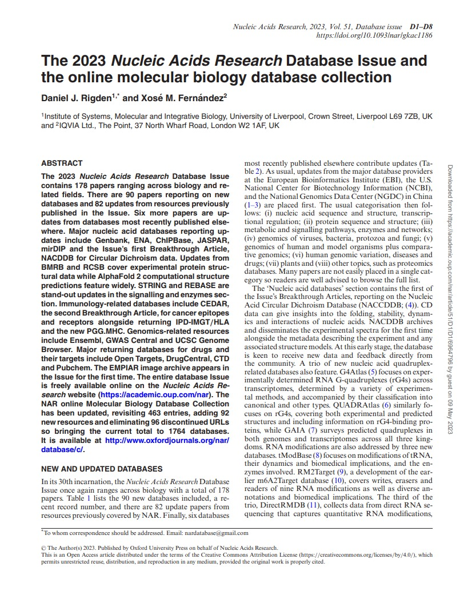
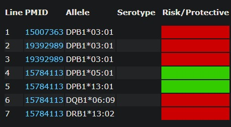

## TASK 1



## TASK 2

[Database Summary Paper Categories (oxfordjournals.org)](https://www.oxfordjournals.org/nar/database/c/)

## TASK 3

Co dwa miesiące.

## TASK 4

Nazwa to "MGDB", znajduje się ona pod linkiem: <http://bioinfo.ahu.edu.cn:8080/Melanoma/>

## TASK 5

Dla 2 z 7 alleli aspiryna podnosi ryzyko chorób autoimmunologicznych.



## TASK 6

Lista wyników spokrewnionych, po wyszukaniu nukleotydów związanych z "Kuzdraliński"

- Fusarium poae (155)
- Rhizopus arrhizus (96)
- Rhizopus stolonifer (54)
- Blumeria graminis f. sp. tritici (33)
- Fusarium sp. (30)
- Puccinia triticina (26)
- Puccinia striiformis f. sp. tritici (22)
- Epicoccum nigrum (18)
- Fusarium sporotrichioides (16)
- Fusarium avenaceum (14)
- Lactobacillus helveticus (9)
- Fusarium culmorum (6)
- Pichia kudriavzevii (4)
- Fusarium graminearum (3)
- Aureobasidium pullulans (3)
- Rhizopus microsporus (3)
- Fusarium equiseti (2)
- Fusarium oxysporum (2)
- Alternaria sp. (2)
- Rhizoctonia solani (2)

## TASK 7

>KJ195691.1 Pichia kudriavzevii isolate 4 26S ribosomal RNA gene, partial sequence
GCGGCGAGTGAGCGGCAGAGCTCAGATTTGAAATCGTGCTTTGCGGCACGAGTTGTAGATTGCAGGTTGG
AGTCTGTGTGGAAGGCGGTGTCCAAGTCCCTTGGAACAGGGCGCCCAGGAGGGTGAGAGCCCCGTGGGAT
GCCGGCGGAAGCAGTGAGGCCCTTCTGACGAGTCGAGTTGTTTGGGAATGCAGCTCCAAGCGGGTGGTAA
ATTCCATCTAAGGCTAAATACTGGCGAGAGACCGATAGCGAACAAGTACTGTGAAGGAAAGATGAAAAGC
ACTTTGAAAAGAGAGTGAAACAGCACGTGAAATTGTTGAAAGGGAAGGGTATTGCGCCCGACATGGGGAT
TGCGCACCGCTGCCTCTCGTGGGCGGCGCTCTGGGCTTTCCCTGGGCCAGCATCGGTTCTTGCTGCAGGA
GAAGGGGTTCTGGAACGTGGCTCTTCGGAGTGTTATAGCCAGGGCCAGATGCTGCGTGCGGGGACCGAGG
ACTGCGGCCGTGTAGGTCACGGATGCTGGCAGAACGGCGCAACACCGCCCGTCTTGAAAC

>KJ195690.1 Pichia kudriavzevii isolate 3 26S ribosomal RNA gene, partial sequence
AGCGGCAAGAGCTCAGATTTGAAATCGTGCTTTGCGGCACGAGTTGTAGATTGCAGGTTGGAGTCTGTGT
GGAAGGCGGTGTCCAAGTCCCTTGGAACAGGGCGCCCAGGAGGGTGAGAGCCCCGTGGGATGCCGGCGGA
AGCAGTGAGGCCCTTCTGACGAGTCGAGTTGTTTGGGAATGCAGCTCCAAGCGGGTGGTAAATTCCATCT
AAGGCTAAATACTGGCGAGAGACCGATAGCGAACAAGTACTGTGAAGGAAAGATGAAAAGCACTTTGAAA
AGAGAGTGAAACAGCACGTGAAATTGTTGAAAGGGAAGGGTATTGCGCCCGACATGGGGATTGCGCACCG
CTGCCTCTCGTGGGCGGCGCTCTGGGCTTTCCCTGGGCCAGCATCGGTTCTTGCTGCAGGAGAAGGGGTT
CTGGAACGTGGCTCTTCGGAGTGTTATAGCCAGGGCCAGATGCTGCGTGCGGGGACCGAGGACTGCGGCC
GTGTAGGTCACGGATGCTGGCAGAACGGCGCAACACCGCCCGTCTTGAAC

>KJ195689.1 Pichia kudriavzevii isolate 4 internal transcribed spacer 1, partial sequence; 5.8S ribosomal RNA gene and internal transcribed spacer 2, complete sequence; and 28S ribosomal RNA gene, partial sequence
CTACACTGCGTGAGCGGACGAAAACAACAACACCTAAAATGTGGAATATAGCATATAGTCGACAAGAGAA
ATCTACGGACAAGAGAAATCTACGAAAAAACAAACAAAACTTTCAACAACGGATCTCTTGGTTCTCGCAT
CGATGAAGAGCGCAGCGAAATGCGATACCTAGTGTGAATTGCAGCCATCGTGAATCATCGAGTTCTTGAA
CGCACATTGCGCCCCTCGGCATTCCGGGGGGCATGCCTGTTTGAGCGTCGTTTCCATCTTGCGCGTGCGC
AGAGTTGGGGGAGCGGAGCGGACGACGTGTAAAGAGCGTCGGAGCTGCGACTCGCCTGAAAGGGAGCGAA
GCTGGCCGAGCGAACTAGACTTTTTTTCAGGGACGCTTGGCGGCCGAGAGCGAGTGTTGCGAGACAACAA
AAAGCTCGACCTCAAATCAGGTAGGAATACCCGCTGAACTTAAGCATATCAATAAGCGGAGGAAAAGGAT
CATTACTGTGATTTAGTA

>KJ195688.1 Pichia kudriavzevii isolate 3 internal transcribed spacer 1, partial sequence; 5.8S ribosomal RNA gene and internal transcribed spacer 2, complete sequence; and 28S ribosomal RNA gene, partial sequence
AAACAACAACACCTAAAATGTGGAATATAGCATATAGTCGACAAGAGAAATCTACGAAAAACAAACAAAA
CTTTCAACAACGGATCTCTTGGTTCTCGCATCGATGAAGAGCGCAGCGAAATGCGATACCTAGTGTGAAT
TGCAGCCATCGTGAATCATCGAGTTCTTGAACGCACATTGCGCCCCTCGGCATTCCGGGGGGCATGCCTG
TTTGAGCGTCGTTTCCATCTTGCGCGTGCGCAGAGTTGGGGGAGCGGAGCGGACGACGTGTAAAGAGCGT
CGGAGCTGCGACTCGCCTGAAAGGGAGCGAAGCTGGCCGAGCGAACTAGACTTTTTTTCAGGGACGCTTG
GCGGCCGAGAGCGAGTGTTGCGAGACAACAATAAGCTCGACCTCAAATCAGGTAGGAATACCCGCTGAAC
TTAAGCATATCAATAAGCGGAGGAAAAGGATCATTACTGTGATTTAGTA

## TASK 8

JX669571

## TASK 9

Zakładam, że *ostatni* autor, jest to ostatni wymieniony autor w publikacji [na stronie NCBI](https://www.ncbi.nlm.nih.gov/nuccore/JX669571.1). Jest to "Targonski,Z", więc zakładam, że jest to Zdzisław Jan Targoński w bazie Nauki Polskiej, ponieważ tylko on posiada jakiekolwiek publikacjie.

Ostatnia (najnowsza) wymieniona pubikacja to: "2014, A new insight into the physiological role of bile salt hydrolase among intestinal bacteria from the genus *Bifidobacterium, Piotr Paweł Jarocki, Paweł Robert Glibowski, Zdzisław Jan Targoński | Artykuł*".

## TASK 10

Na stronie scholar.google.com, jest wiele nowszych publikacji, a najnowsza z nich (ostatnia) to: "[A novel biocatalyst, Enterobacter aerogenes LU2, for efficient production of succinic acid using whey permeate as a cost-effective carbon source](https://scholar.google.com/citations?view_op=view_citation&hl=pl&user=PGOB5M0AAAAJ&sortby=pubdate&citation_for_view=PGOB5M0AAAAJ:lSLTfruPkqcC)H Szczerba, E Komoń-Janczara, K Dudziak, A Waśko, Z TargońskiBiotechnology for biofuels 13 (1), 1-12" z 2020 roku.

W formacie zbliżonym do APA (ponieważ Markdown nie obsługuje regulowania wcięć, odstępów wmiędzy wierszami i kontroli akapitów):

Szczerba, H., Komoń-Janczara, E., Dudziak, K., Waśko, A., & Targoński, Z. (2020). A novel biocatalyst, Enterobacter aerogenes LU2, for efficient production of succinic acid using whey permeate as a cost-effective carbon source. Biotechnology for biofuels, 13(1), 1-12. https://doi.org/10.1186/s13068-020-01789-8

## TASK 11

Ocenia się na 20,024.

## TASK 12

W latach 90. XX w. szacowano, że liczba ludzkich genów wynosi ponad 100 tysięcy. Dzięki wynikom projektu HGP możliwe było dokładniejsze oszacowanie liczby genów w genomie człowieka.

 Analizy z 2008 roku wskazywały, że liczba ta jest znacznie mniejsza i wynosi około 23 tysięcy.

## TASK 13

50 818 468 bp

## TASK 14

Chromosomy są uporządkowane po kolei od 1 do 18,, potem 20, 19, Y, 22 i 21.

## TASK 15

```

1. Homo sapiens chromosome 1, GRCh38.p14 Primary Assembly
248,956,422 bp linear DNA 
NC_000001.11 GI:568815597

2. Homo sapiens chromosome 2, GRCh38.p14 Primary Assembly
242,193,529 bp linear DNA 
NC_000002.12 GI:568815596

3. Homo sapiens chromosome 3, GRCh38.p14 Primary Assembly
198,295,559 bp linear DNA 
NC_000003.12 GI:568815595

4. Homo sapiens chromosome 4, GRCh38.p14 Primary Assembly
190,214,555 bp linear DNA 
NC_000004.12 GI:568815594

5. Homo sapiens chromosome 5, GRCh38.p14 Primary Assembly
181,538,259 bp linear DNA 
NC_000005.10 GI:568815593

6. Homo sapiens chromosome 6, GRCh38.p14 Primary Assembly
170,805,979 bp linear DNA 
NC_000006.12 GI:568815592

7. Homo sapiens chromosome 7, GRCh38.p14 Primary Assembly
159,345,973 bp linear DNA 
NC_000007.14 GI:568815591

8. Homo sapiens chromosome X, GRCh38.p14 Primary Assembly
156,040,895 bp linear DNA 
NC_000023.11 GI:568815575

9. Homo sapiens chromosome 8, GRCh38.p14 Primary Assembly
145,138,636 bp linear DNA 
NC_000008.11 GI:568815590

10. Homo sapiens chromosome 9, GRCh38.p14 Primary Assembly
138,394,717 bp linear DNA 
NC_000009.12 GI:568815589

11. Homo sapiens chromosome 11, GRCh38.p14 Primary Assembly
135,086,622 bp linear DNA 
NC_000011.10 GI:568815587

12. Homo sapiens chromosome 10, GRCh38.p14 Primary Assembly
133,797,422 bp linear DNA 
NC_000010.11 GI:568815588

13. Homo sapiens chromosome 12, GRCh38.p14 Primary Assembly
133,275,309 bp linear DNA 
NC_000012.12 GI:568815586

14. Homo sapiens chromosome 13, GRCh38.p14 Primary Assembly
114,364,328 bp linear DNA 
NC_000013.11 GI:568815585

15. Homo sapiens chromosome 14, GRCh38.p14 Primary Assembly
107,043,718 bp linear DNA 
NC_000014.9 GI:568815584

16. Homo sapiens chromosome 15, GRCh38.p14 Primary Assembly
101,991,189 bp linear DNA 
NC_000015.10 GI:568815583

17. Homo sapiens chromosome 16, GRCh38.p14 Primary Assembly
90,338,345 bp linear DNA 
NC_000016.10 GI:568815582

18. Homo sapiens chromosome 17, GRCh38.p14 Primary Assembly
83,257,441 bp linear DNA 
NC_000017.11 GI:568815581

19. Homo sapiens chromosome 18, GRCh38.p14 Primary Assembly
80,373,285 bp linear DNA 
NC_000018.10 GI:568815580

20. Homo sapiens chromosome 20, GRCh38.p14 Primary Assembly
64,444,167 bp linear DNA 
NC_000020.11 GI:568815578

21. Homo sapiens chromosome 19, GRCh38.p14 Primary Assembly
58,617,616 bp linear DNA 
NC_000019.10 GI:568815579

22. Homo sapiens chromosome Y, GRCh38.p14 Primary Assembly
57,227,415 bp linear DNA 
NC_000024.10 GI:568815574

23. Homo sapiens chromosome 22, GRCh38.p14 Primary Assembly
50,818,468 bp linear DNA 
NC_000022.11 GI:568815576

24. Homo sapiens chromosome 21, GRCh38.p14 Primary Assembly
46,709,983 bp linear DNA 
NC_000021.9 GI:568815577

25. Homo sapiens mitochondrion, complete genome
16,569 bp circular DNA 
NC_012920.1 GI:251831106

```

## TASK 16

240,251

## TASK 22

Search query: Poland[Affiliation]
Year,Count
2022,26147
2021,27901
2020,23639
2019,18676
2018,17296
2017,15962
2016,15123
2015,13743

## TASK 17

Są dwie publikacje po query: `(intestinal cancer[Title]) AND (Poland[Affiliation])`:

- PMID: 14555796
- PMID: 12721399

## TASK 18

Population: Total
Group: Globab
Sample Size: 74968
Ref Allele: A = 0.32646
Alt Allele: G=0.67354, T=0.0

todo *TODO: Zamienić w tabelę*

## TASK 19

MAF jest to częstotliwość występowania drugiego najczęściej występującego allelu w danej populacji.

## TASK 20

W populacji Afrykańskiej

## TASK 21

GGKYTRRGGTTAGCTTTYRAGTTTTTTGATTTTKGATTTTTGTCTTTTTAGCTGTTATTW
RTCAAACCTTYDBGGGDRAAAGAAVTGMARTCACCACAGGRCAGAAACCBTAAGGGAAAA
YAWTAAYAYTAGCTAAGAACATAAAAGAAYAYACARTTRCTTAATCATATAADTGTCTGA
MGTTAAYTGTCCATYYAATTGTGATTTSTACCCAGAAGGRCHRAGCYTGTRYACTYTTCA
YGGYYYAGAGYSAATRTCYTGTCYMARCTTCTCCTGCYRRCYCMCHVYGBTCTCCACRTC
ASTGDGTYAYCKCAAGAAAAMGCCCCTCCAAGRRGHCTSRTYCCYYACACYTHDGGHACA
GMATTCRYGGAAWGGAAARSYRTABDGRACATRCCYRABRDTCYTCAVTYCCACAGAWAC
AGGGAGRRGCTGGGAAGCTCWTTCTACRGATGSRGWAACAGYTCAARYCAGGCCYCCYGT
GCCTRTCAGCCTTYYTCSCAGTCCARYRYTCCYGASAGAYGTTTGGYTGCCYCAGTGRHG
GGRYRCTCCTTTCTTTYYCAGGTTRSCARTTCTGKTYCAGRYAKYTRYTYAGMAAGYCCC
TATTCCTCCTGAGTSCAGCTCTTCAYGGCYATCCCTKYCCYRTCTYASTCACCYYTMTGC
TCCCATTTTCCAYRTRTTTGGCAAGCACYKGTTGAGYTAYMAATGACTGTGCAGVCTTGT
GYCASGSATCCCCTGGGGTAAAAGGCRTMCCCTGGMGYTGTGYCACAAAASAGMCCACAC
AWTRGACTTRGGCTTAACAAG

## TASK 22

Jest to Fasarium poae - gatunek grzybów.

## TASK 23

37,7  Mb

## TASK 24

Contig N50: 62 040 b

Jest to długość sekwencji, która jest osiągana przez 50% całkowitej długości sekwencji.

## TASK 25

Lipaza Q05469 

## TASK 26

Biorę inny: **Colipase** P04118 i jest cofactorem pancreatic lipase

## TASK 27

3D structure databases:

- [AlphaFoldDB](https://www.uniprot.org/database?query=(name:AlphaFoldDB)&direct)
  - [P04118](https://alphafold.ebi.ac.uk/entry/P04118)
- [SMR](https://www.uniprot.org/database?query=(name:SMR)&direct)
  - [P04118](https://swissmodel.expasy.org/repository/uniprot/P04118?csm=772872EBBE7C4DF8)
- [ModBase](https://www.uniprot.org/database?query=(name:ModBase)&direct)
  - [Search…](https://salilab.org/modbase-cgi/model_search.cgi?searchkw=name&kword=P04118)

## TASK 28

Enzymy o tym samym numerze EC mogą występować u różnych gatunków, ale ich sekwencje aminokwasowe są różne. Różnice te wynikają z mutacji i zmian w sekwencjach DNA w trakcie ewolucji 

## TASK 29

202

## TASK 30

Jest to gen kodujący receptor Dopaminy D3

## TASK 31

Odmiana polimorfizmu: [rs167771](https://www.snpedia.com/index.php/Rs167771)

Fenotyp: Individuals carrying the AA variant of the rs167771 SNP scored significantly higher on the IS-factor (resp U = 590, p < .01), indicating more rigid behavior than individuals carrying one or two copies of the minor G-allele.

## TASK 32

29 903 bp

## TASK 33

Grudzień 2019

## TASK 34

MFVFLVLLPLVSSQCVNLTTRTQLPPAYTNSFTRGVYYPDKVFRSSVLHSTQDLFLPFFSNVTWFHAIHVSGTNGTKRFDNPVLPFNDGVYFASTEKSNIIRGWIFGTTLDSKTQSLLIVNNATNVVIKVCEFQFCNDPFLGVYYHKNNKSWMESEFRVYSSANNCTFEYVSQPFLMDLEGKQGNFKNLREFVFKNIDGYFKIYSKHTPINLVRDLPQGFSALEPLVDLPIGINITRFQTLLALHRSYLTPGDSSSGWTAGAAAYYVGYLQPRTFLLKYNENGTITDAVDCALDPLSETKCTLKSFTVEKGIYQTSNFRVVPSGDVVRFPNITNLCPFGEVFNATRFASVYAWNRKRISNCVADYSVLYNSASFSTFKCYGVSPTKLNDLCFTNVYADSFVVKGDDVRQIAPGQTGKIADYNYKLPDDFMGCVLAWNTRNIDATSTGNYNYKYRYLRHGKLRPFERDISNVPFSPDGKPCTPPALNCYWPLNDYGFYTTTGIGYQPYRVVVLSFELLNAPATVCGPKLSTDLIKNQCVNFNFNGLTGTGVLTESNKKFLPFQQFGRDIADTTDAVRDPQTLEILDITPCSFGGVSVITPGTNASSEVAVLYQDVNCTEVPVAIHADQLTPTWRVYSTGSNVFQTWCFDNPYKFVDGNCTHVLYDSDKIQLDEEAN
